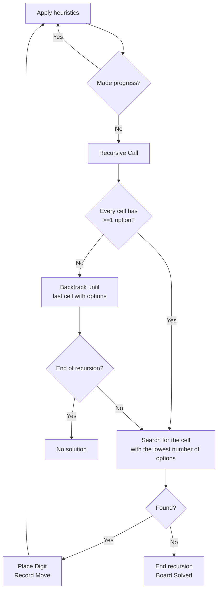

# Max's Sudoku solver

Hey! this is a sudoku solver that uses a heuristic backtracking algorithm to solve sudoku boards real fast. 
I have built it in c#, with an emphasis on **Speed**, **Generics**, **OOP Principles** and of course **SOLID Principles** in mind.

## How does it work?

The program reads a user string input from the console or from a file which contains the string puzzle (puzzles can differ in sizes from 1x1 , 9x9, 16x16..., the program should solve any NxN puzzle as long as the number N is a perfect square), then it validates the board according to the sudoku rules, and begins to solve.

### The Solving algorithm
 - The solving algorithm first tries to use heuristics (known human tactics) to place as many numbers as he can.
 - Then the recursive algorithm begins; first it checks if every cell has atleast 1 option, if not then we can prune this branch.
 - It finds the cell with the lowest available number of options, and then starts placing the lowest one each time.
 - Each move gets recorded (saved), and the recursive call happens again, if all of the cells options lead to false (no path found) then **backtrack** to the last point you were able to choose the next option of a        cell and continues.
 - If there are no empty cells left, that means the board is full and therefore, solved.
 

## Optimizations 
### Bitwise

To make the algorithm not only correct, but also fast, I used integar bit masks to represent the options for each cell and performed bitwise operations on them, thus making things like these very fast:

**Toggle** a digit on or off with bitwise AND or OR operations.

**Check** whether a digit is allowed by seeing if a particular bit is set.

**Count** how many digits remain using `BitOperations.PopCount()`.

**Identify** the next available digit with `BitOperations.TrailingZeroCount()`.
      
Overall resulting in   **Fast Lookups and Updates**  - Whenever a digit is placed, the solver updates the corresponding bits across all affected cells in O(1) time.
   
And **Minimal Memory Usage**  - Because each cell’s state is just one integer, we don’t need additional arrays or large data structures to track possibilities. Everything stays compact which is crucial for performance on larger boards like 16×16 or 25×25.
   

### Heuristics 

**Naked Singles**
If a cell’s bitmask has only one remaining possibility (just one bit set), that digit is placed immediately - no guessing required.
This heuristic is quite simple yet very effective. It reduces the puzzle’s complexity by pruning trivial cases first. Placing these certain digits up front prevents unnecessary backtracking.

**Hidden Singles**
Even if a cell’s bitmask has multiple possibilities, the digit may appear in exactly one cell in a particular row, column, or block. If so, that single possibility is “hidden” and can be placed right away.
This heuristic is also considered a simple one, it cuts down search time by revealing forced moves that aren’t obvious from a single cell’s bitmask alone, which makes it a bit more complex than naked singles.

**Naked Pairs**
  If two cells within the same row, column, or block share exactly the same two possibilities, then those possibilities can be removed from every other cell in that group.
By eliminating digits in other cells, future steps (including Naked/Hidden Singles) often become available, speeding up the solve time.

All of the heuristics share a **Cells‐to‐Process Queue**
Each time a digit is placed by any heuristic, the solver adds neighboring cells (in the same row, column, or block) to a queue for re-checking because their options bitmask now may have changed. The queue ensures you only rescan affected cells rather than the whole board, making heuristics more efficient.

By methodically applying these heuristics (and using the queue to track relevant cells), we greatly reduce the search space before the main backtracking even begins, resulting in faster solves and less guesses overall.

_Note: From the tests I have done, I've noticed that different boards react differently to various heuristics, some benefit from using all 3 of the heuristics, and some can be solved much faster by using only one. Therefore i've made the decision to let the user choose (if they want to) which "Algorithm Level" they want to use (because why not :). From applying only naked singles for level 1, to applying naked singles and hidden pairs for level 2 and finally applying all of the heuristics for level 3.
There is also a level 0 which basically means default setting - level 2 for boards up to 16x16 and level 3 for larger boards._

# The UI

### Users will be presented with 3 main options
**1.** Solve a given board\
**2.** Change algorithm level (optional)\
**3.** Exit

And the current algorithm level.

### Solver
The user types '1' and hits Enter, then he is presented with the next screen.
Firstly, the user is asked to provide a valid board size, he then proceeds to choose the input method (console or a text file).
Lastly, the user is asked to enter board string.
-

The user is provided with the solution of the board and the time it took for the algorithm to solve it.
-

The user can also choose to read from a file by providing the file's path or the name of the file (needs to be located at a specific path).
**The user can then choose to write the solution to the same file or a different one (that will be created).**
-

And when there's no solution for the board, the user is presented accordingly.
-

### **Algorithm Level**
If the user chooses the 2nd option, he will be presented with the following screen.
There are 4 levels to choose from, as described in the explanations of each level.
-

**The program will save the algorithm level of the user for the next boards**

# Tests
The tests cover up pretty much all of the input types that constitute tricky edge cases, those that dont pass validation, and regular ones.

**To run the tests** - right-click the project and click on "Run Tests".

# How to install and run the project

**Clone or Download** - 
  Clone the repository from GitHub, or download and extract the .zip file of this project to your local machine.

**Launch Visual Studio (or Your Preferred IDE)** - 
  Open the solution file (.sln) or the containing folder.

**Build the Project** - 
  Click Build or press Ctrl+Shift+B (in Visual Studio) to compile the solution.

**Run the Project** - 
  You did it my friend, now go solve some sudoku boards and flex on your grandpa.

  Here is a board for you to get started:
    
    003000002080050000700800049000000100006003000900500078009060014000400200100000500

# That's it, I hope you enjoy it as much as i did! Ω

  
